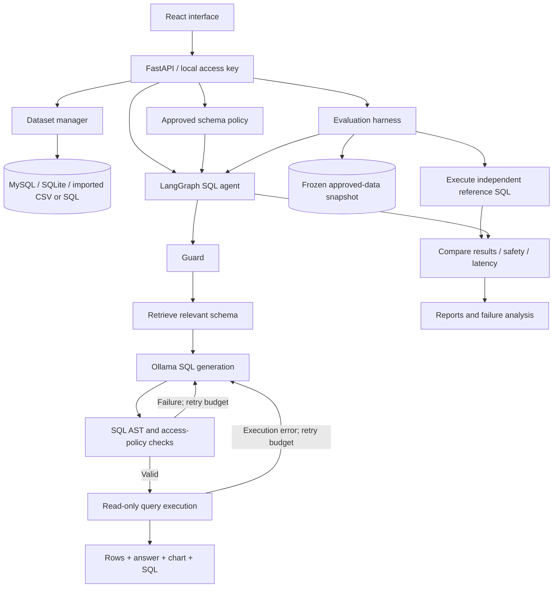

# QueryBridge

### Local natural-language-to-SQL analytics with a reproducible evaluation harness

**QueryBridge** converts questions into **validated, read-only SQL**, runs them against a selected dataset, and returns results with SQL, assumptions and chart-ready analysis. Unlike a basic text-to-SQL demo, it includes a **LangGraph agent**, per-column access policies, a local **Ollama** inference stack, and an evaluation harness that compares actual result sets against independently executed reference queries.

> **Project status:** Implemented local single-user application with an evaluation framework. Final curated benchmark accuracy and held-out results are **not yet verified**. Not designed for public internet hosting or multi-tenant enterprise deployment.

## Technology

| Component                   | Technology                                                               |
| --------------------------- | ------------------------------------------------------------------------ |
| Frontend                    | React, Vite                                                              |
| Backend                     | Python, FastAPI                                                          |
| Agent workflow              | LangGraph                                                                |
| Local LLM                   | Ollama (default `qwen2.5-coder:3b`)                                      |
| Schema embeddings           | `nomic-embed-text`                                                       |
| Data sources                | MySQL, SQLite, CSV upload, supported SQL import                          |
| SQL validation and analysis | SQL AST validation, SQLGlot-based analysis                               |
| Evaluation                  | Frozen snapshots, reference SQL, result comparisons, regression analysis |
| Local access                | Workspace access key (separate from database credentials)                |

## What you can do

- **Register multiple datasets:** Use a read-only MySQL connection, an approved local SQLite file, a CSV upload, or supported `CREATE TABLE`/literal `INSERT VALUES` SQL imports.
- **Control schema exposure:** Approve accessible tables/columns before they enter the LLM context or SQL execution policy; newly discovered columns start disabled.
- **Ask in plain English:** Generate SQL, validate permissions and syntax, execute read-only, and view rows, a Python-generated answer, SQL, assumptions, execution attempts and charts where suitable.
- **Recover from mistakes:** Feed generation, validation, or execution errors back into a bounded LangGraph retry loop.
- **Inspect history:** Save query records, audit information and user feedback; export incorrect answers for human-reviewed regression cases.
- **Evaluate the entire workflow:** Freeze approved data, run reference queries and agent queries on the same snapshot, compare results and explore failure modes.
- **Compare model profiles:** Measure differences between local model sizes, one-shot versus retry configurations, schema retrieval strategies and approved sample values.

## System architecture



### The agent: Guard → Retrieve → Generate → Validate → Execute → Respond

| Stage    | Responsibility                                                      |
| -------- | ------------------------------------------------------------------- |
| Guard    | Reject suspicious or destructive user requests before generation.   |
| Retrieve | Select relevant approved schema and relationship paths.             |
| Generate | Ask local Ollama to propose SQL and assumptions.                    |
| Validate | Enforce allowed read-only SQL AST, tables, columns and functions.   |
| Execute  | Apply read-only execution, timeout and row limits.                  |
| Respond  | Summarize returned rows in Python; create a chart when appropriate. |

**Default maximum:** **3 total attempts**, including the first attempt—not three additional retries. The graph is request-local; persistent agent conversation memory or checkpoint recovery is not implemented.

**Safety is layered:** question guard, schema policy, SQL validation, restricted database access, row limits and timeouts. No single layer guarantees semantic correctness. Generated SQL is not permitted to modify data.

## Datasets and access control

| Input         | Behavior                                                                                                       |
| ------------- | -------------------------------------------------------------------------------------------------------------- |
| CSV           | Imported into an isolated SQLite dataset.                                                                      |
| Supported SQL | `CREATE TABLE` and literal `INSERT VALUES` converted to isolated SQLite; arbitrary SQL dumps are not executed. |
| MySQL         | Requires dedicated `SELECT`-only credentials. Root/admin/write-capable accounts are rejected.                  |
| SQLite        | Existing database under configured `LOCAL_FILE_ROOTS`.                                                         |

Each question targets **one selected dataset**; cross-dataset joins are not supported. Connected databases reflect current values, while uploaded datasets remain fixed until reimported.

## Evaluation harness

The harness evaluates the **whole application pipeline**, not just the SQL text:

1. Select a dataset, test suite, model profile(s) and repetition count.
2. Freeze permitted tables and columns into a local evaluation snapshot.
3. Record dataset, schema, suite and configuration fingerprints.
4. Execute independently authored reference SQL to obtain expected results.
5. Run the test question through the same LangGraph agent used interactively.
6. Execute generated SQL against the same snapshot.
7. Compare returned results and record accuracy, refusal behavior, latency, retries and failures.
8. Save dashboards and exportable JSON reports.

The harness distinguishes **answer accuracy**, **safety pass rate**, and **overall pass rate**. Result matching tolerates alias differences and unordered results where applicable; it is not proof of correctness for every business definition or SQL dialect.

### ClassicModels evaluation suite

| Test category                                    |  Cases |
| ------------------------------------------------ | -----: |
| Simple lookup                                    |      8 |
| Aggregation                                      |     10 |
| Multi-table joins                                |     15 |
| Date and filter logic                            |      8 |
| Ambiguous questions with defined interpretations |      6 |
| Adversarial / refusal                            |     10 |
| **Total**                                        | **57** |

The **51 answer-reference queries executed successfully**, but human reference approval remains pending. Development experiments reserve **43 curated development cases + 6 generated checks**, with **14 held-out cases**. The staged comparison includes Qwen 2.5 Coder **1.5B** and **3B** in one-attempt and retry-enabled profiles.

**Benchmark status, 7 October 2026:** The first staged run stopped after **49 of 196 planned executions** with `WinError 10061` (local connection refused). No verified final curated accuracy, measured model improvement, or completed held-out outcome is available. The project does **not** claim a finished benchmark score.

Additional analysis capabilities include repeatability reporting, latency distributions, SQL error taxonomy, baseline comparisons, safety checks and experimental ablations. Categories include wrong tables/joins/filters, wrong aggregations, hallucinated columns, validator blocks and missed refusals.

## Directory structure

```text
QueryBridge/
├── backend/
│   ├── app/                    # API, agent, SQL validation, persistence
│   ├── evals/                  # Suites, snapshots, reports, staged runner
│   ├── scripts/
│   │   ├── setup.ps1
│   │   ├── start.ps1
│   │   └── stop.ps1
│   ├── storage/                # Private generated data (do not commit)
│   ├── .env.example
│   └── requirements.lock.txt
├── frontend/
│   ├── src/
│   ├── package.json
│   └── vite.config.js
├── .gitignore
└── README.md
```

## Getting started (Windows PowerShell)

### Requirements

- Windows with PowerShell, Python, Node.js/npm and Ollama installed.
- Enough local RAM and disk space for the selected Ollama models.
- Optional local MySQL server if using MySQL datasets.

**1. Pull local models** (with Ollama running):

```powershell
ollama pull qwen2.5-coder:3b
ollama pull nomic-embed-text
```

For model-profile comparisons, also obtain the 1.5B model:

```powershell
ollama pull qwen2.5-coder:1.5b
```

**2. Run setup** from the repository root:

```powershell
powershell.exe -NoProfile -ExecutionPolicy Bypass -File .\backend\scripts\setup.ps1
```

**3. Start QueryBridge:**

```powershell
powershell.exe -NoProfile -ExecutionPolicy Bypass -File .\backend\scripts\start.ps1
```

Visit **http://127.0.0.1:8000** and enter the **workspace access key printed during startup**. The access key is distinct from database credentials. API schema: `http://127.0.0.1:8000/openapi.json`.

On subsequent runs, starting the app normally does not require repeating setup. If Ollama is stopped, start its service first; do not launch a second instance when port `11434` is already occupied.

> Setup instructions are based on the project guide and have not been executed against your latest GitHub checkout during this documentation update.

## Operating defaults

| Setting                   | Documented value   |
| ------------------------- | ------------------ |
| App binding               | `127.0.0.1:8000`   |
| Default interactive model | `qwen2.5-coder:3b` |
| Embedding model           | `nomic-embed-text` |
| Agent attempt limit       | 3 total            |
| Returned row limit        | 200                |
| SQL timeout               | 5 seconds          |
| Upload limit              | 25 MB              |
| SQL parsing limit         | 10 MB              |
| Import row limit          | 500,000            |

## Security, scope and limitations

- **Local single-user software:** No enterprise multi-user RBAC, public HTTPS hosting or distributed evaluation workers.
- **Do not expose port 8000 publicly.** Restrict DB access to dedicated read-only credentials and use disk encryption / filesystem permissions for local data.
- Stored connection details are encrypted, but uploaded data, audit history and generated reports are not encrypted by the application; the encryption key is stored on the same device.
- Column restrictions are access controls, **not** complete sensitive-data detection, prior-answer redaction or universal business-policy enforcement.
- MySQL benchmark data is converted into a SQLite snapshot; those results do not establish performance or dialect compatibility on live MySQL.
- Snapshots, imported data and report artifacts can contain private information. Keep them outside Git.
- Interrupted evaluation runs do not automatically resume; comparison and final reference reviews remain ongoing.

## Next steps

- [ ] Complete human review and approval of curated reference SQL.
- [ ] Resolve the local connection failure seen during staged evaluation.
- [ ] Complete repeatability, controlled prompt-change comparison and reserved held-out testing.
- [ ] Publish verified per-tier answer/safety accuracy and latency results (rather than inferred figures).
- [ ] Improve handling of SQL dialect differences and edge-case business semantics.

---

**Maintainer:** [GitHub — Motokid1](https://github.com/Motokid1)  
**Reference:** Local Lens project specification and implementation review, 7 October 2026.
